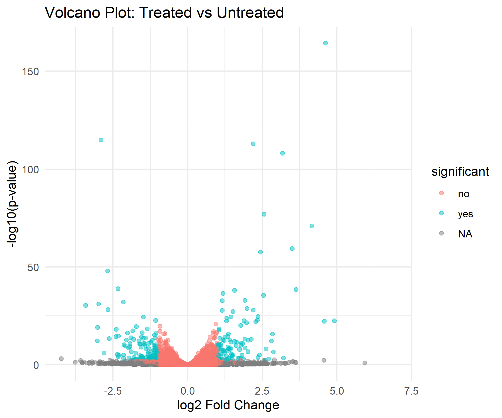

# What happens when you knock down pasilla?

A differential expression analysis of RNA-seq data from *Drosophila melanogaster*, looking at what changes in the transcriptome when the *pasilla* gene is knocked down.

Data: [GSE18508](https://www.ncbi.nlm.nih.gov/geo/query/acc.cgi?acc=GSE18508), Brooks et al. — 7 samples (4 untreated, 3 treated), ~14,600 genes.

## The approach

Raw counts and sample metadata went into DESeq2, using condition (treated vs untreated) as the design. DESeq2 handled normalization and the statistical testing; I filtered the output down to genes with an adjusted p-value under 0.05.

## What I found

845 genes came out significantly different between the two groups. A handful of these had striking effect sizes — the top hit showed roughly a 24-fold change with a p-value small enough to be essentially unambiguous.

Each point is a gene. The ones in teal cleared both thresholds — padj < 0.05 and at least a 2-fold change in either direction.

## In this repo

- `deseq2_analysis.R` — the full script, start to finish
- `significant_genes.csv` — the filtered gene list, sorted by significance
- `volcano_plot.png` — the plot above

## Built with

Python (Biopython, pandas) for the early data handling, R (DESeq2, ggplot2) for the statistics and plotting.